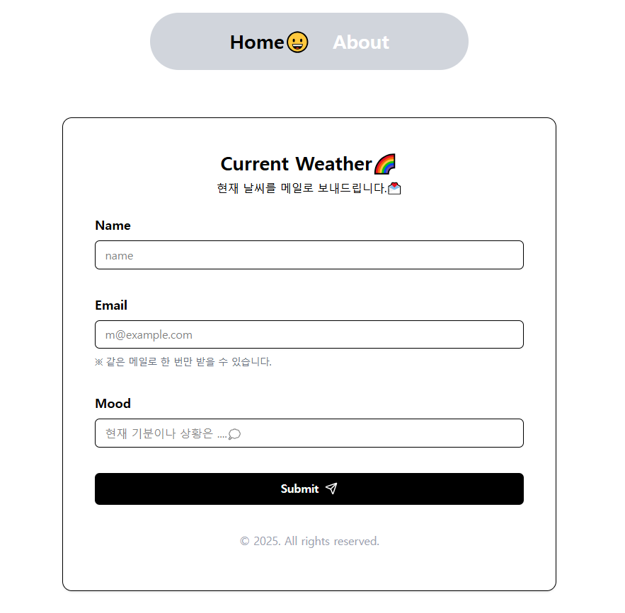
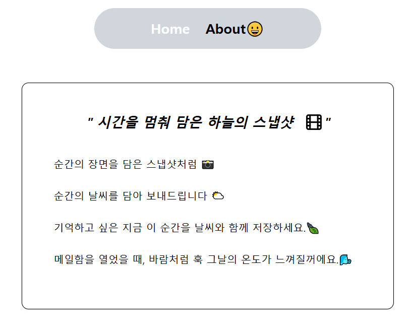
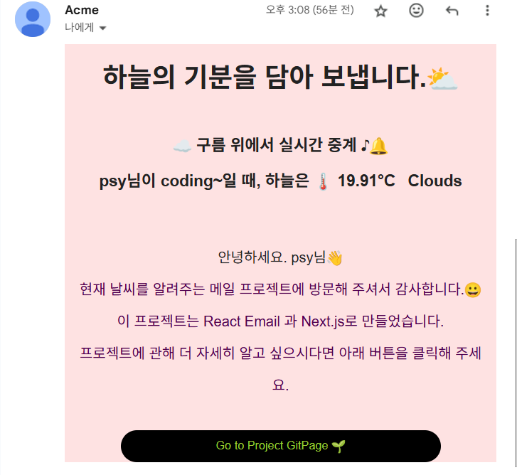

<h1 align="center"> Current Weather App🌈</h1>

<h3  align="center"> 현재의 날씨를 메일📩로 보내주는 weather-mail 서비스입니다.

<h4 align="center"> 순간의 장면을 담은 스냅샷처럼 📸, 순간의 날씨를 담아서 보내드립니다.🍃

<h4 align="center"> 기억하고 싶은 순간을 날씨와 함께 저장하세요.⛅

 <h5 align="center">🌈[current-weather-app 보러가기]()

### \*️⃣완성 이미지

<!-- ◼ **Main**

◼ **About page**
 -->

|Main|About-page|email|
|:----:|:------:|:---:|
||||

<!-- ◼ **Email**
 -->

### 1️⃣ 기술스택

- FrameWork : Next.js
- Library : React Email, Zod, Resend
- Language : TypeScript
- Styling : tailwind, shadcn
- DB : Prisma, sqlite

### 2️⃣ 페이지 기능

#### ◼ **_Main_**

- **Nav**
  - 사용자가 현재 어느 페이지에 있는지 active하게 알려주기 위해 **usePathname** 사용
  - SPA의 장점을 그대로 활용하기 위해서 **Link component**로 페이지 전환
- **Form**
  - **shadcn** 사용
    1. 사용자에게 간결하고 트렌디한 디자인을 제공
    2. 가볍고 커스텀하기 쉬움
    3. **zod**를 사용한 양식 유효성 검사와 오류 메시지 처리기능  
       등의 편의를 위해 선택
  - **server**와의 연결
    1. form data를 server action에서 필요한 결과값으로 반환
    2. 반환됨 값을 **fetch( )** 메소드로 server에 전달
    3. **Resend**로 react-email component에 필요한 값 전달

#### ◼ **_About page_**

- Project의 소개

#### ◼ **_Email_**

- **React Email**로 email 템플릿 생성
- **Resend**를 통해 받은 data를 함께 전송

#### ◼ **_DB_**

weather email은 동일한 mail주소로 1번만 받을 수 있다.
때문에 사용자 mail주소를 DB에 저장하여, 이전에 mail을 받은 사용자인지 구분한다.

- **sqlite**  
  별도의 서버 소프트웨어를 설치하거나 실행할 필요 없이, 애플리케이션 내에서 직접 데이터베이스 파일을 다룰 수 있어서 선택
- **prisma**  
  prisma ORM을 사용하여 data 정의, 추가, 관리를 쉽게 할 수 있다

### 3️⃣ 트러블 슈팅

1. **form에서 입력한 name과 mood를 사용하기 위해서 schema 형식 변경**

   - 없던 값을 추가하는 과정에서 오류 발생.  
    → 새로 추가하는 값이 *@default*라서 기존 test값들과 충돌 발생   
    → prisma studio의 값을 모두 delete해주고 다시 prisma migrate 해줌

2. **날씨 API를 react email 에서 받아 올 수 없음**
   - react email은 정적 페이지라서 API를 바로 받아서 사용할 수 없다.  
      받아온 값을 그려주는 것만 가능하다.  
     → server에서 데이터를 받아서 props 형태로 email page로 전달  
     1) server action에서 weather API값을 불러와서 return값에 함께 반환  
     2) 반환된 값을 fetch( )메서드로 server에 전달
     3) server에서 resend를 통해서 react email에 사용할 data 전달
